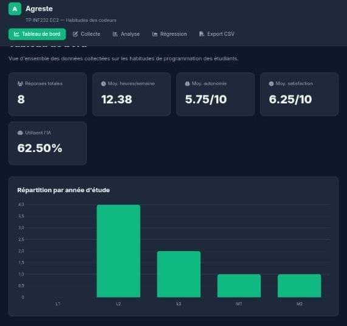

# Agreste
 
Web application for collecting and statistically analyzing students' programming habits.
University of Yaoundé I — INF232 EC2 coursework.
 

 
## Features
 
- **Dashboard**: overview with KPIs (total responses, average coding hours, AI usage rate…)
- **Data collection**: interactive form to record habits (age, year of study, preferred language, coding hours, etc.)
- **Descriptive analysis**: statistics (mean, median, standard deviation) and charts (age histogram, language breakdown, autonomy by year, satisfaction vs. hours)
- **Linear regression**: study of the correlation between AI usage and autonomy
- **CSV export**: download of the collected data
## Tech stack
 
- Python
- Streamlit (web interface)
- Pandas / NumPy (data processing and analysis)
- Matplotlib (visualizations)
- SQLite (local storage for responses)
## Project structure
 
```
AGRESTE/
├── app.py            # Streamlit application (UI + navigation)
├── database.py        # SQLite connection (init, insert, read)
├── analyse.py          # statistics and linear regression
├── requirements.txt
└── .gitignore
```
 
## Installation
 
```bash
git clone https://github.com/Adrienmounchili/AGRESTE.git
cd AGRESTE
python -m venv venv
source venv/bin/activate  # Windows: venv\Scripts\activate
pip install -r requirements.txt
```
 
## Running the app
 
```bash
streamlit run app.py
```
 
The app opens automatically in your browser. Responses are stored locally in `agreste.db` (SQLite), created automatically on first run.
 
## Author
 
Adrien Mounchili
 
